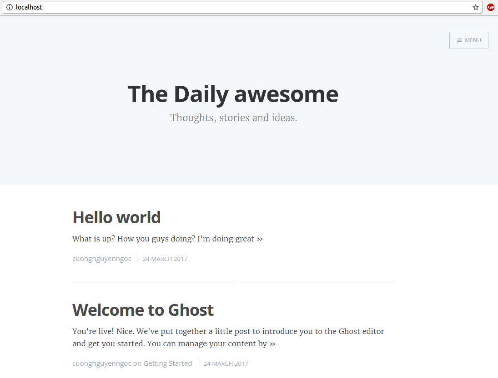
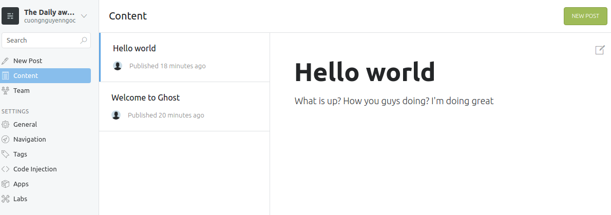

1. Configuration & install docker
  * Update your droplet
  ```
  sudo apt-get update && sudo apt-get -y upgrade
  ```
  * Make sure aufs support is available
  ```
  sudo apt-get install linux-image-extra-`uname -r`
  ```
  * Add docker repository key to apt-key for package verification:
  ```
  sudo apt-key adv --keyserver hkp://pgp.mit.edu:80 --recv-keys 58118E89F3A912897C070ADBF76221572C52609D
  ```
  * Add the docker repository to Apt sources:
  ```
  echo "deb https://apt.dockerproject.org/repo ubuntu-trusty main" | sudo tee /etc/apt/sources.list.d/docker.list
  ```
  * Update the repository with the new addition and install docker-engine:
  ```sudo apt-get update && sudo apt-get install docker-engine```
  * To manage docker as a non-user root
    * Create the docker group.
    ```sudo groupadd docker```
    * Add your user to the docker group.
    ```sudo usermod -aG docker $USER```
    * Log out and log back in so that your group membership is re-evaluated.
    Verify that you can docker commands without sudo.
    ```docker run hello-world```
  * Some command to get the hang of docker
    * To pull docker image from docker-hub
    ``` docker pull docker_image_name```
    * To list all images
    ``` docker images```
    * To run a container from an image
    ``` 
    docker run -d --name container_name -p port_exported:port_of_container docker_image_name
    ```
    (option -d: to run in background, --name: to set name to container, -p to export port to use outside container)
    * To list all containers
    ``` docker ps -a```
    * To list all containers which are running
    ``` docker ps```
    * To start a docker container
    ``` docker start container_name/container_id```
    * To stop a docker container
    ``` docker stop container_name/container_id```
    * To use command in a running container (or debug a running container)
    ``` docker exec -it container_name/container_id COMMAND```
    For example: ```docker exec -it ubuntu bash```
    * Some ways to debug a running container that also include command above 
      * ```docker logs container_name/container_id```
      This will give you full STDOUT, STDERR from the command that was run initially in the container
      * ```docker cp container_name/container_id:/path/to/useful/file /local/path```
      This will copy file from the container to your host. So you can examine the file and see what was wrong

Learn more here [Docker docs official](https://docs.docker.com/engine/getstarted/)

2. Configuration & install docker-compose
  * Install by using Curl
  ```
  sudo curl -o /usr/local/bin/docker-compose -L "https://github.com/docker/compose/releases/download/1.11.2/docker-compose-$(uname -s)-$(uname -m)" && sudo chmod +x /usr/local/bin/docker-compose
  ```
  * Install by using pip
  ```pip install docker-compose```
  * To check whether docker-compose is installed
  ```docker-compose -v```
3. Docker-compose example
  * Basic example
    * Create a directory for the project:
    ```mkdir composetest```
    ```cd composetest```
    * Create a file called ```app.py``` in your project directory and paste this in:
    
    ```
    from flask import Flask
    from redis import Redis

    app = Flask(__name__)
    redis = Redis(host='redis', port=6379)

    @app.route('/')
    def hello():
        count = redis.incr('hits')
        return 'Hello World! I have been seen {} times.\n'.format(count)

    if __name__ == "__main__":
        app.run(host="0.0.0.0", debug=True)
    ```
    * Create a ```Dockerfile``` to build an web image
    ```
    FROM python:3.6
    WORKDIR /code
    RUN pip install flask redis
    CMD ["python", "app.py"]
    ```
    * Define services in a Compose file ```docker-compose.yml```
    
    ```
    version: '2'
    services:
      web:
        build: .
        ports:
          - "5000:5000"
        volumes:
          - .:/code
      redis:
        image: "redis:latest"
    ```
    * Build and run your app with Compose
    ```docker-compose up```
    
    if everything works well, just type ```localhost:5000``` on your browser to see how it works
    * Update your application, change code in ```app.py```. For example change 
    
    ```
    return 'Hello from container! I have been seen {} times.\n'.format(count)
    ```
    * To remove entirely your containers
    ```docker-compose down```
    
    Learn more here: [Docker compose](https://docs.docker.com/compose/gettingstarted/)

  * More interesting example: Using docker-compose to run Ghost (a publish platform)
    * Edit file config in Ghost to use MYSQL database
      * Firtly, pull ghost image from docker hub and run it
      ```docker pull ghost```
      ```docker run -d --name ghost -p 80:2360 ghost```
      * Copy file config.js from ghost container to local:
      ```
      docker cp -L ghost:/usr/src/ghost/config.js ./config.js
      ```
      * Edit config.js to use MYSQL database because by default, ghost use sqlite3 for storing data.
      
      ```
      development: {
        // #### Database
        // Ghost supports sqlite3 (default), MySQL & PostgreSQL
        database: {
            client: 'mysql',
            connection: {
                host: 'mysql',
                user: 'ghost',
                password: 'password',
                database: 'ghost',
                charset: 'utf8'
            },
            debug: false
        },
        // #### Server
        // Can be host & port (default), or socket
        server: {
            // Host to be passed to node's `net.Server#listen()`
            host: '0.0.0.0',
            // Port to be passed to node's `net.Server#listen()`, for iisnode set this to `process.env.PORT`
            port: '2368'
        },
        // #### Paths
        // Specify where your content directory lives
        paths: {
            contentPath: path.join(process.env.GHOST_CONTENT, '/')
        }
    }
    ```
    * Now remove ```ghost``` container to prevent conflict when building our own web ghost with mysql database
    ```docker rm -f ghost```
    * Create a ```Dockerfile``` to build our own ghost
    
    ```
    FROM ghost
    COPY ./config /var/lib/ghost/config.js
    ```
    * Create a ```docker-compose.yml``` to define services
    
    ```
    version: '2'
    services:
      mysql:
        image: mysql
        container_name: mysql
        ports:
          - "3066"
        environment:
          - MYSQL_ROOT_PASSWORD=root
          - MYSQL_DATABASE=ghost
          - MYSQL_USER=ghost
          - MYSQL_PASSWORD=password
      ghost:
        build: .
        container_name: ghost
        depends_on:
          - mysql
        ports:
          - "80:2368"
    ```
    * Now let's run our web app
    ```docker-compose up```
    * If everything works well, check your browser by typing ```localhost:80``` to see ghost page. 
    
    * Go to ```localhost:80/ghost/setup``` to create a new ```post```.
    
    * Check ```post``` in mysql database in mysql container
    ```docker exec -it mysql bash```
      * To access to mysql use this command in mysql container:
      ```mysql --user=ghost --password=password```
      * At mysql database, run this: ```use ghost;``` to use ghost database
      * Check what is in ```posts``` table: ```select * from posts;```, you should see a new ```post``` which you've just created on ghost web page
    * To remove entirely containers of app run:
    ```docker-compose down```
    
    Learn more here: [Introduction to Docker Compose Tool for Multi-Container Applications](https://www.linux.com/learn/introduction-docker-compose-tool-multi-container-applications)


